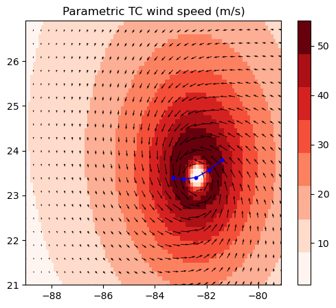
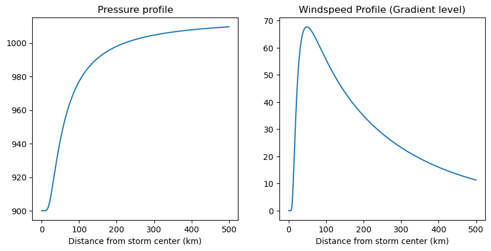

## ParaTC: Parametric Tropical Cyclones

Statistical tropical cyclone models are frequently used in modelling wind and storm surge risk for coastal communities. This package makes their generation easier, and exposes equations to generate pressure profiles, wind profiles, apply inflow angles, add background fields and scale winds. The package also provides functions for converting generated windfields into a forcing file for the ROMS ocean model.

You can either interact with the equations and modules to generate storms directly, or you can use the TCModel class to automate it.

See the example notebooks in docs/ for some basic tutorials.

This package is only for the generation of storm wind fields, stress and pressure with flexibility. If you want to do risk analyses, other great packages exist such as Climada and TCRM.

<p align="center">
	
</p>

### Installation

For development:

1. Clone this repository and change directory into it.
2. Install dependencies using `environment.yml`: `conda env create -n paratc_env -f environment.yml`.
3. Activate the environment: `conda activate paratc_env`
4. Install the package: `pip install -e .`

### Modules

1. `bg_models`: Functions for the generation of background flow fields. 
2. `inflow_models`: Functions for the generation of gridded inflow angles, to apply to tropical cyclone fields.
3. `rmw_models`: Statistical models of radius of maximum winds.
4. `stress_models`: Functions for the conversion of wind vectors into wind stress.

### TC Models

All tropical cyclone models are children of the `TCModel()` class. Therefore, the functionality available to `TCModel` is also available to other cyclone models.

1. `TCModel()`: Stores the cyclone dataset and processed track information. Contains functions for automatically applying inflow angles, background models, wind scaling, interpolation and conversion to model forcing.
2. `Holland1980()`: The (Holland, 1980) model is one of the most prominent tropical cyclone models. This class provides functions for generating pressure and wind profiles, and estimating the shape parameter `B`. 

## Example Useage

For more in depth examples see docs/.

### Basic Equations
You can generate a Holland pressure and gradient wind profile as follows:

```python
# Imports...
import numpy as np
from paratc.tc_models import Holland1980 as h80

# Make 1D array of storm center distances ... out to 1000km
rdist = np.arange( 0, 1000, 0.5 )
B = h80.B_vickery00( 1015-900, 50 )

# Make pressure / gradient winds
pressure = h80.pressure_equation( rdist, rmw = 50, B = B, penv = 1015,
                                         pcen = 900, lat = 35 )
windspeed = h80.gradient_wind_equation( rdist, rmw = 50, B = B, pdelta = 1015-900,
                                        lat = 35 ) 
```

<p align="left">
	
</p>

### Functions for inflow angle, background flow and wind stress

You can access models for inflow angle, background flow and wind stress:
```python
from paratc import inflow_models, bg_models, stress_models

# Make inflow angle using piecewise function of distance
angle = inflow_angle.wang20( rdist, rmw = 50 )

# Make background wind field that decays with distance from storm center
u_bg, v_bg = bg_models.MN05( rdist, utrans = 1, vtrans = 1, rmw = 50 )

# Make wind stress as quadratic function of wind speed
drag_coef = stress_models.cd_garratt( 10 )
stress = stress_models.quadratic_stress_equation( windspeed = 10, cd = drag_coef )
```

### Using a TCModel to automate storm generation
We can generate entire 2D storm fields, with an added time dimension as follows:

```python
# Imports. We only need h80 for the class based approach
from paratc.tc_models import Holland1980 as h80
from paratc import make_example_data

# Open example track and generate example grid
track, grid_lon, grid_lat = make_example_data()

# Create storm instance and look at dataset
storm = h80( track, grid_lon, grid_lat, B_model='vickery00' )

# Scale winds to surface level
storm.scale_winds( 0.91 )

# Apply piecewise inflow angle model
storm.make_wind_vectors( inflow_model = 'wang20' )

# Add background winds using reciprocal relationship
storm.add_background_winds( bg_alpha = .55, bg_beta = 20 )
```

## Contribution
At the moment this package only have functionality for the Holland model. Please feel free to contact me if you would like to contribute to the package.
